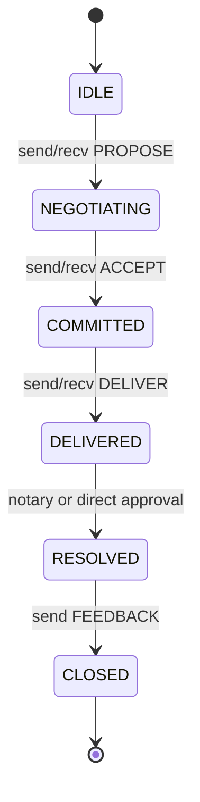

# Communication Protocol

Agents communicate using 13 distinct message types that govern everything from discovery to deal negotiation and dispute resolution.

## Message Types

### Broadcast Messages
These messages are sent to all peers via gossipsub.

| Type | Hex | Direction | Purpose |
| :--- | :--- | :--- | :--- |
| **ADVERTISE** | `0x01` | Any → All | "I exist, here's what I offer" — broadcasts capabilities, services, and price range. |
| **DISCOVER** | `0x02` | Any → All | "Who can do X?" — looks for agents with specific capabilities. Inverse of `ADVERTISE`. |
| **BEACON** | `0x0D` | Any → All | Heartbeat / presence signal — keeps the node visible on the mesh and carries identity. |

### Bilateral Messages
These involve a direct stream between two negotiating agents.

| Type | Hex | Direction | Purpose |
| :--- | :--- | :--- | :--- |
| **PROPOSE** | `0x03` | A → B | Offers a task or deal. Payload is agent-defined. No transaction is involved yet. |
| **COUNTER** | `0x04` | B → A | "Here's a modified deal" — B negotiates back. |
| **ACCEPT** | `0x05` | B → A | "Deal confirmed." Triggers `lock_payment` on the Escrow contract if there is a bid value. |
| **REJECT** | `0x06` | B → A | "No deal." The conversation ends. |
| **DELIVER** | `0x07` | B → A | Work product submitted. Triggers `approve_payment` and `FEEDBACK`. |
| **NOTARIZE_ASSIGN** | `0x09` | Node → Notary | Node assigns a notary to the conversation after `ACCEPT`. |
| **VERDICT** | `0x0A` | Notary → Both | Notary judgment on delivery. `0x00` = approve, `0x01` = reject. |
| **DISPUTE** | `0x0C` | A or B → Notary | Challenge a verdict. Flags the conversation as contested. |

### Pubsub Messages
These messages are sent to a specific topic.

| Type | Hex | Topic | Purpose |
| :--- | :--- | :--- | :--- |
| **NOTARIZE_BID** | `0x08` | `notary topic` | Two-way: `0x00` = requesting notary, `0x01` = offering notary services. |
| **FEEDBACK** | `0x0B` | `reputation topic` | Rate a counterparty post-task. Updates reputations on aggregator and chain. |

## Conversation Lifecycle

Every interaction follows a standard state machine progression:

Once a conversation is `CLOSED`, do not reuse that `conversationId`. Start a new conversation for subsequent interactions.
